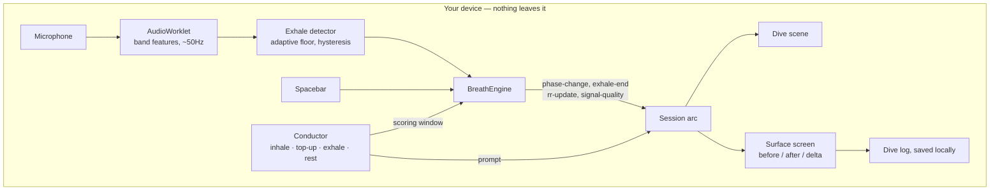

# FATHOM

**A game you play with your breath. Five minutes to a measurably calmer body.**

Built for [Hack for Humanity | Summer 2026](https://hack-for-humanity-summer-26.devpost.com/) — Best Mental Health Tool track.

You're a diver descending a bioluminescent ocean. The only controller is your
microphone: a double inhale charges your dive light, a long slow exhale propels
you down. The input pattern is **cyclic sighing** — longer, smoother exhales
make you better at the game, and a respiratory-rate readout shows what your
breathing actually did, measured before and after.

- No chatbot. No account. No data leaves your device.
- Trains arousal regulation, measured live. Not therapy, not diagnosis.
- In crisis? **988** (US) · **9-8-8** (Canada) · [findahelpline.com](https://findahelpline.com)

## Why build it this way

Support is rationed by supply. US school counselor caseloads run at roughly
**376 students to one counselor** — well past the 250:1 the profession
recommends ([ASCA][asca]) — and clinical biofeedback, the closest established
relative of what this does, is typically delivered in supervised sessions at
**$100+ each**. The gap is not a lack of things to read. It is a lack of
anything that works in the ten minutes before an exam.

So this is deliberately small: one exercise, five minutes, a number at the end,
and then it tells you to leave. It is not trying to be a companion, a journal or
a therapist.

**It is also deliberately not a chatbot.** There is no conversational surface
anywhere in the product, and nothing in it generates or interprets text. That is
a safety position rather than a technical shortcut — the regulatory and
professional direction of travel on software that presents itself as therapy is
toward restriction, and an app that measures your breathing and hands you the
number stays on the right side of that line by construction.

## How it works



Audio is reduced to a handful of numbers on the audio thread and never recorded,
buffered for upload, or sent anywhere. There is no server. The deployed artifact
is a folder of static files.

**The exhale is measured. The inhale is not.** An audible inhale is broadband
turbulent noise that our feature set cannot reliably tell apart from an exhale,
so the app *prompts* inhales on a rhythm and only listens for what follows.
Every breathing rate in the app and in this README is counted from exhale onsets.
We say so on the scope screen, on the surface screen, and inside the exported
file, because a fidelity claim that only appears in the README is a fidelity
claim nobody reads.

### Layout

| Path | What lives there |
|---|---|
| `src/breath/` | Signal engine: capture, band features, exhale detection, calibration, rate estimation |
| `src/breath/types.ts` | The contract between the two halves |
| `src/game/input/` | Input sources: scripted fixture, spacebar, shared rate estimator |
| `src/game/session/` | Prompt conductor, cycle geometry, session arc |
| `src/game/scene/` | Descent model and the dive scene |
| `src/game/surface/` | Surface screen and dive log export |
| `src/shell/` | Scope screen, crisis rail, English/French strings |

## What the game rewards

The reward loop is isolated in [`src/game/scene/descent.ts`](src/game/scene/descent.ts) so it can be
audited without reading a renderer. Three properties hold by construction:

- **Longer always beats shorter.** Depth is strictly increasing in exhale length.
- **Slower beats faster.** Depth is *super-linear* in exhale length, so over an
  identical twelve seconds of exhaling, twelve one-second breaths travel 7.5m and
  two six-second breaths travel 21.8m. Breathing faster to fit in more breaths is
  strictly worse.
- **Breath-holds earn nothing.** Depth only advances on an exhale. A held breath
  is not punished; it simply is not a move.

Difficulty adapts to the baseline it measured, and **can only ever slow the
target**. That rule is enforced in the conductor rather than trusted to callers,
and there is a floor below which the prompt will not go.

## Honest limitations

- One session is not evidence about anyone's health, and the app says so.
- Respiratory rate is inferred from detected exhale onsets, not from a chest
  strap or a capnograph. It is a good relative measure within a session and
  should not be read as a clinical vital sign.
- Smoothness scoring is a heuristic tuned against our own recordings, not a
  validated metric.
- The spacebar path cannot judge smoothness at all — a key is down or it is not
  — so quality there is exhale length only. The surface screen names which input
  was used.
- Cyclic sighing is evidenced as a **practice**; this is a game built around that
  practice, and the game itself has not been trialled.

## Citations

1. Balban MY, Neri E, Kogon MM, Weed L, Nouriani B, Jo B, Holl G, Zeitzer JM,
   Spiegel D, Huberman AD. **Brief structured respiration practices enhance mood
   and reduce physiological arousal.** *Cell Reports Medicine*, 2023;4(1):100895.
   RCT, n=114; cyclic sighing produced greater improvement in mood and greater
   reduction in respiratory rate than mindfulness meditation over 28 days.
   <https://doi.org/10.1016/j.xcrm.2022.100895>
2. Zaccaro A, Piarulli A, Laurino M, Garbella E, Menicucci D, Neri B, Gemignani A.
   **How breath-control can change your life: a systematic review on
   psycho-physiological correlates of slow breathing.** *Frontiers in Human
   Neuroscience*, 2018;12:353. <https://doi.org/10.3389/fnhum.2018.00353>
3. Lehrer PM, Gevirtz R. **Heart rate variability biofeedback: how and why does it
   work?** *Frontiers in Psychology*, 2014;5:756.
   <https://doi.org/10.3389/fpsyg.2014.00756>
4. Linehan MM. **DBT Skills Training Manual**, 2nd ed. Guilford Press, 2015. Paced
   breathing is the *P* in the TIPP distress-tolerance skill.
5. American School Counselor Association. **School counselor roles and ratios.**
   Student-to-counselor ratio data. [asca][asca]

[asca]: https://www.schoolcounselor.org/About-School-Counseling/School-Counselor-Roles-Ratios

## Run

```bash
npm install
npm run dev        # development server
npm run build      # production build into dist/
npx tsc -b         # typecheck
npx oxlint         # lint

node src/game/testing/run.ts   # tests — no build step, no dependencies
```

The tests cover the parts where being wrong is both expensive and silent: the
respiratory-rate estimate, the descent scoring that enforces "slower always
wins", and the prompt geometry.

Deployment is declared in [`render.yaml`](render.yaml) as a static site. HTTPS is
required, not optional: browsers refuse microphone access on an insecure origin.

## Team

Max ([storm2928](https://github.com/storm2928)) · [cjasink](https://github.com/cjasink)
