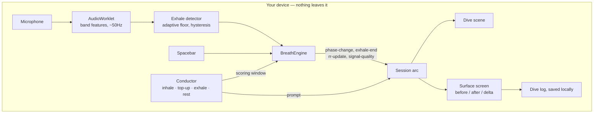

# FATHOM

**A game you play with your breath. Five minutes to a measurably calmer body.**

Built for [Hack for Humanity | Summer 2026](https://hack-for-humanity-summer-26.devpost.com/), Best Mental Health Tool track.

You're a diver going down through a dark, glowing ocean. The only controller is
your breath: two quick breaths in charge your dive light, and one long, slow
breath out sends you deeper. That pattern is called **cyclic sighing**, and it's
the breathing exercise from a 2023 clinical trial (see the citations at the
bottom). The longer and smoother you breathe out, the better you do in the game.
When you surface, the app shows you your breathing rate from before and after,
so you can see what actually changed.

- No chatbot. No account. Nothing you say or breathe ever leaves your device.
- It trains arousal regulation, measured live. It is not therapy and not a diagnosis.
- If you're in crisis, please talk to a person: **988** (US) · **9-8-8** (Canada) · [findahelpline.com](https://findahelpline.com)

## Why we built it this way

Help is hard to get when you actually need it. In the US there are about
**372 students for every school counselor** (2024–25), way past the 250:1 the
profession recommends ([ASCA][asca]). Biofeedback, which is the closest thing
clinics offer to what this app does, usually means a supervised session at
**$100 or more** each. The problem isn't a lack of stuff to read about anxiety.
It's that almost nothing works in the ten minutes before an exam, when you're
sitting there on your own with a phone.

So we kept it small on purpose. One exercise, five minutes, one number at the
end, and then the app tells you to leave. It doesn't try to be a companion, a
journal, or a therapist.

**It's also deliberately not a chatbot.** There's no chat anywhere in it, and
nothing in it writes or interprets text. That's a safety choice, not a shortcut.
Software that acts like a therapist is heading toward tighter rules, and an app
that just measures your breathing and shows you the number stays clear of that
by design.

## How it works



The microphone audio gets boiled down to a handful of numbers about fifty times
a second, right on the audio thread. It's never recorded, never held for upload,
and never sent anywhere. There's no server at all. What we deploy is a folder of
static files.

**We measure the breath out. We don't measure the breath in.** A breath in sounds
like broadband noise, and the few numbers we track can't reliably tell it apart
from a breath out. So the app *prompts* you to breathe in on a rhythm and only
listens for what comes after. Every breathing rate in the app and in this README
is counted from the start of each exhale. We say this on the first screen, on
the surface screen, and inside the file you can save, because a caveat that only
lives in the README is a caveat nobody reads.

### Where things live

| Path | What's in there |
|---|---|
| `src/breath/` | The signal engine: mic capture, band features, exhale detection, calibration, breathing-rate estimate |
| `src/breath/types.ts` | The contract between the two halves of the project |
| `src/game/input/` | Input sources: a scripted test fixture, the spacebar, the shared rate estimator |
| `src/game/session/` | The prompt conductor, the breathing-cycle geometry, the session arc |
| `src/game/scene/` | The descent model and the dive scene |
| `src/game/surface/` | The surface screen and the dive-log export |
| `src/shell/` | The first screen, the crisis rail, English and French text |

## What the game rewards

The scoring lives in one small file,
[`src/game/scene/descent.ts`](src/game/scene/descent.ts), so anyone can check it
without reading the renderer. Three things are always true:

- **Longer beats shorter.** The longer you breathe out, the deeper you go. Always.
- **Slower beats faster.** Depth grows faster than exhale length does. Over the
  same twelve seconds of breathing out, twelve one-second breaths get you 7.5 m
  and two six-second breaths get you 21.8 m. Breathing faster to squeeze in more
  breaths is just worse.
- **Holding your breath does nothing.** You only move on a breath out. A held
  breath isn't punished. It just isn't a move.

The difficulty adapts to the breathing rate we measured from you at the start,
and it **can only ever ask you to slow down**. That rule is enforced in the code
that runs the rhythm, not left up to whoever calls it, and there's a floor it
will never go below.

## Honest limitations

- One session doesn't tell you anything about your health, and the app says so.
- The breathing rate comes from detected exhales, not from a chest strap or a
  medical device. It's a good before-and-after comparison within one session.
  It is not a clinical vital sign.
- The smoothness score is a rule of thumb we tuned on our own recordings, not a
  validated measurement.
- The spacebar mode can't judge smoothness at all (a key is either down or it
  isn't), so there quality is just exhale length. The surface screen tells you
  which input you used.
- Cyclic sighing has evidence behind it as a **practice**. This is a game built
  around that practice, and the game itself hasn't been tested in a trial.

## Citations

1. Balban MY, Neri E, Kogon MM, Weed L, Nouriani B, Jo B, Holl G, Zeitzer JM,
   Spiegel D, Huberman AD. **Brief structured respiration practices enhance mood
   and reduce physiological arousal.** *Cell Reports Medicine*, 2023;4(1):100895.
   Randomised controlled trial (114 enrolled, 108 randomised); cyclic sighing produced greater improvement in mood and greater
   reduction in respiratory rate than mindfulness meditation over 28 days.
   <https://doi.org/10.1016/j.xcrm.2022.100895>
2. Zaccaro A, Piarulli A, Laurino M, Garbella E, Menicucci D, Neri B, Gemignani A.
   **How breath-control can change your life: a systematic review on
   psycho-physiological correlates of slow breathing.** *Frontiers in Human
   Neuroscience*, 2018;12:353. <https://doi.org/10.3389/fnhum.2018.00353>
3. Lehrer PM, Gevirtz R. **Heart rate variability biofeedback: how and why does it
   work?** *Frontiers in Psychology*, 2014;5:756.
   <https://doi.org/10.3389/fpsyg.2014.00756>
4. Linehan MM. **DBT Skills Training Manual**, 2nd ed. Guilford Press, 2015. Paced
   breathing is the *P* in the TIP distress-tolerance skills.
5. American School Counselor Association. **School counselor roles and ratios.**
   Student-to-counselor ratio data. [asca][asca]

[asca]: https://www.schoolcounselor.org/About-School-Counseling/School-Counselor-Roles-Ratios

## Run it

```bash
npm install
npm run dev        # development server
npm run build      # production build into dist/
npx tsc -b         # typecheck
npx oxlint         # lint

node --import ./src/game/testing/resolve.mjs src/game/testing/run.ts   # tests — no build step, no dependencies
```

The tests cover the parts where being wrong would be both expensive and easy to
miss: the breathing-rate estimate, the descent scoring that makes "slower always
wins" true, and the prompt timing.

Deployment is set up in [`render.yaml`](render.yaml) as a static site. It has to
be HTTPS: browsers won't give a page the microphone otherwise.

## Team

Max ([storm2928](https://github.com/storm2928)) · Cole ([cjasink](https://github.com/cjasink))
