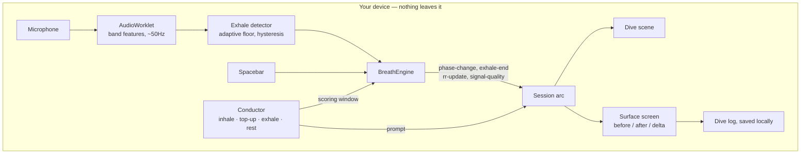

# FATHOM

**A game you play with your breath. Five minutes to a measurably calmer body.**

Built for [Hack for Humanity | Summer 2026](https://hack-for-humanity-summer-26.devpost.com/), Best Mental Health Tool track.

You play as a diver descending into a dark ocean lit by glowing objects. The only controller is your breathing: two short breaths activate the dive light and one long slow exhalation causes the diver to descend. This pattern of breathing is known as **cyclic sighing** and was used in a 2023 clinical study (see citations at the bottom). The longer and smoother the exhalation, the better the player performs in the game. Upon surfacing, the app will display the player's breathing rate before and after the dive allowing for comparison.

- Nothing you say or breathe ever leaves your device.
- It trains arousal regulation, measured live. It is not therapy and not a diagnosis.
- If you're in crisis, please talk to a person: **988** (US) · **9-8-8** (Canada) · [findahelpline.com](https://findahelpline.com)

## Why we built it this way

Help is hard to get when you actually need it. In the US there are about
**372 students for every school counselor** (2024–25), way past the 250:1 the
profession recommends ([ASCA][asca]). Biofeedback, which is the closest thing
clinics offer to what this app does, usually means a supervised session at
**$100 or more** each. The problem isn't a lack of stuff to read about anxiety.
It's that almost nothing works in the ten minutes before an exam, when you're
sitting there on your own with a phone.

So we kept it small on purpose. One exercise for only five minutes.

**It's also deliberately not a chatbot.** There's no chat anywhere in it, and
nothing in it writes or interprets text.
Software that acts like a therapist is heading toward tighter rules, and an app
that just measures your breathing and shows you the number stays clear of that
by design.

## How it works



Audio from the microphone is processed to a few numbers 50 times a second on the audio thread. This data is never recorded, never stored for upload, and never transmitted anywhere. There is no server. What is deployed is a folder of static files.

**We measure the breath out. We do not measure the breath in.** In comes like broadband noise and we cannot reliably differentiate in from out using just a few numbers. Instead, the app asks the user to breathe in according to a certain rate and then only listens to what happens afterwards. All breathing rates recorded by the app and described in this README are measured from the beginning of each exhalation. This is indicated on the front screen, the first screen and in the saved file. A caveat only described in this README will not be read by anyone.
### Where things live

| Path | What's in there |
|---|---|
| `src/breath/` | The signal engine: mic capture, band features, exhale detection, calibration, breathing-rate estimate |
| `src/breath/types.ts` | The contract between the two halves of the project |
| `src/game/input/` | Input sources: a scripted test fixture, the spacebar, the shared rate estimator |
| `src/game/session/` | The prompt conductor, the breathing-cycle geometry, the session arc |
| `src/game/scene/` | The descent model and the dive scene |
| `src/game/surface/` | The surface screen and the dive-log export |
| `src/shell/` | The first screen, the crisis rail, English and French text |

## What the game rewards

The scoring lives in one small file,
[`src/game/scene/descent.ts`](src/game/scene/descent.ts), so anyone can check it
without reading the renderer. Three things are always true:

- **Longer beats shorter.** The longer you breathe out, the deeper you go. Always.
- **Slower beats faster.** Depth grows faster than exhale length does. Over the
  same twelve seconds of breathing out, twelve one-second breaths get you 7.5 m
  and two six-second breaths get you 21.8 m. 
- **Holding your breath does nothing.** You only move on a breath out. A held
  breath isn't punished it simply isn't a move.

The difficulty is based on the breathing rate measured at the beginning of use,
and can only ever request a reduction in that rate. This restriction is built
into the code for the rhythm and is not up to the code that calls the rhythm.
There is a minimum that will not be reached.

## limitations

- A single session does not provide any information about a user’s health.
- The breathing rate is derived from exhalation detections, and not from a chest strap
  or medical device. This provides a before/after measure within a single session,
  but is not a clinical metric.
- Smoothness is an estimate that was tuned using our own recordings. It is not a
  validated metric.
- In spacebar mode, smoothness cannot be assessed (a key is either down or it isn’t).
  Instead, quality is based on the length of the exhalation. The surface display
  informs the user which mode was used.
- Cyclic sighing as a practice has evidence. This game is based on that practice.
  The game has not been tested in a trial.

## Citations

1. Balban MY, Neri E, Kogon MM, Weed L, Nouriani B, Jo B, Holl G, Zeitzer JM,
   Spiegel D, Huberman AD. **Brief structured respiration practices enhance mood
   and reduce physiological arousal.** *Cell Reports Medicine*, 2023;4(1):100895.
   Randomised controlled trial (114 enrolled, 108 randomised); cyclic sighing produced greater improvement in mood and greater
   reduction in respiratory rate than mindfulness meditation over 28 days.
   <https://doi.org/10.1016/j.xcrm.2022.100895>
2. Zaccaro A, Piarulli A, Laurino M, Garbella E, Menicucci D, Neri B, Gemignani A.
   **How breath-control can change your life: a systematic review on
   psycho-physiological correlates of slow breathing.** *Frontiers in Human
   Neuroscience*, 2018;12:353. <https://doi.org/10.3389/fnhum.2018.00353>
3. Lehrer PM, Gevirtz R. **Heart rate variability biofeedback: how and why does it
   work?** *Frontiers in Psychology*, 2014;5:756.
   <https://doi.org/10.3389/fpsyg.2014.00756>
4. Linehan MM. **DBT Skills Training Manual**, 2nd ed. Guilford Press, 2015. Paced
   breathing is the *P* in the TIP distress-tolerance skills.
5. American School Counselor Association. **School counselor roles and ratios.**
   Student-to-counselor ratio data. [asca][asca]

[asca]: https://www.schoolcounselor.org/About-School-Counseling/School-Counselor-Roles-Ratios

## Run it

```bash
npm install
npm run dev        # development server
npm run build      # production build into dist/
npx tsc -b         # typecheck
npx oxlint         # lint

node --import ./src/game/testing/resolve.mjs src/game/testing/run.ts   # tests — no build step, no dependencies
```

The tests cover the parts where being wrong would be both expensive and easy to
miss: the breathing-rate estimate, the descent scoring that makes "slower always
wins" true, and the prompt timing.

Deployment is set up in [`render.yaml`](render.yaml) as a static site. It has to
be HTTPS: browsers won't give a page the microphone otherwise.

## Team

Max ([storm2928](https://github.com/storm2928)) · Cole ([cjasink](https://github.com/cjasink))
